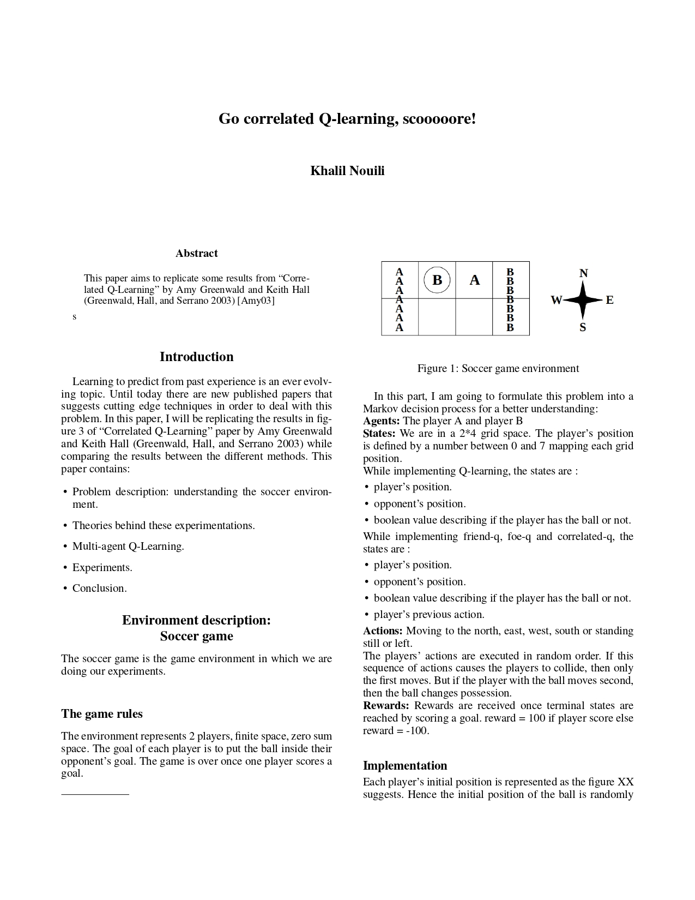
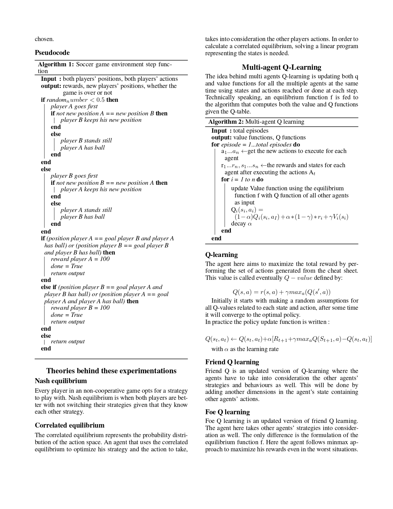
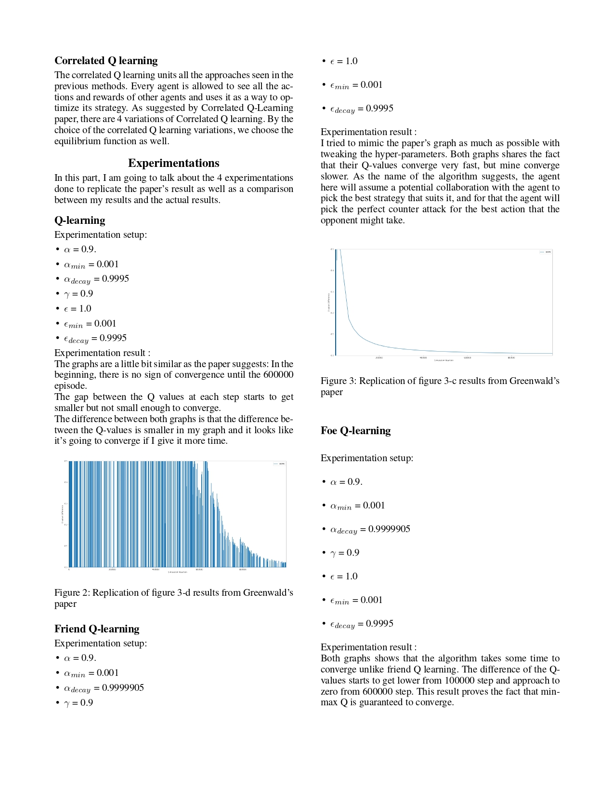
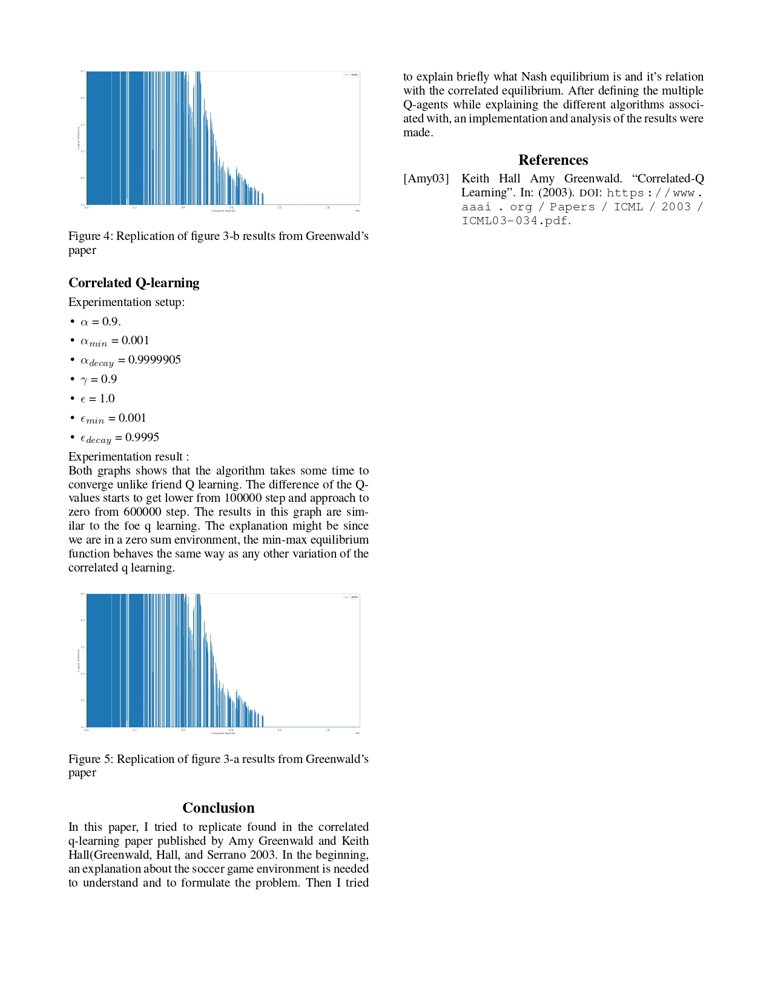

# Go correlated Q learning, scooooooooore !

This project aims to replicate some results from “Correlated Q-Learning” by Amy Greenwald and Keith Hall (Greenwald, Hall, and Serrano 2003) by implementing:
```
- Q learning
- Friend-q learning 
- Correlated-q learning 
- Foe-q learning
```

## Getting Started

These instructions will get you a copy of the project up and running on your local machine.
### Prerequisites

In order to get this prpject running on our machine, you need to have

```
Python v3.6
Jupyter-notebook
```

### Installing

After setting up the environmnet, you need to install the used python libraries in this project

```
 pip3 install -r requirements.txt
```

## Run the project
This project is divided into 4 parts.
Each part represnts one algorithm to train with.

In order to train the agent usig q-learning run:
```
 python3 q-learning.py
```
In order to train the agent usig friend q run:
```
 python3 friendq.py
```
In order to train the agent usig foeq run:
```
 python3 foeq.py
```
In order to train the agent usig corrcorrelated q-learning run:
```
 python3 correlatedqlearning.py
```

In order to test the agent's performance run:
```
 python3 showgraphs.py
```


## More about the project 





